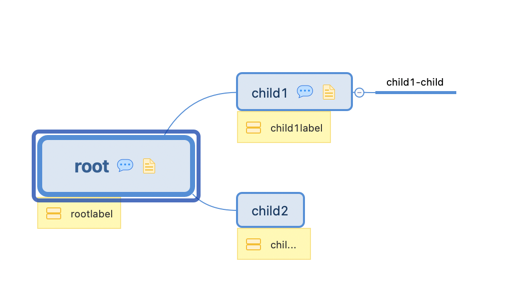

# Table of Contents
- [Parse old version xmind](#parse-old-version-xmind)
- [Parse new version xmind](#parse-new-version-xmind)

## Parse old version xmind

### example
```golang
f := "xmindold/xmind_old.xmind"
tree := v1.Parse(f)
empJSON, _ := json.MarshalIndent(tree, "", "  ")
fmt.Printf("MarshalIndent funnction output \n%s\n", string(empJSON))
```
### output
```bigquery
MarshalIndent funnction output 
{
  "XMLName": {
    "Space": "urn:xmind:xmap:xmlns:content:2.0",
    "Local": "xmap-content"
  },
  "Sheet": {
    "XMLName": {
      "Space": "urn:xmind:xmap:xmlns:content:2.0",
      "Local": "sheet"
    },
    "Topic": {
      "XMLName": {
        "Space": "urn:xmind:xmap:xmlns:content:2.0",
        "Local": "topic"
      },
      "ID": "5rna56dvhk7jjbedtvbj5sgj58",
      "Name": "root",
      "Note": "root beizhu",
      "Label": "rootlabel",
      "Html": "",
      "Children": [
        {
          "XMLName": {
            "Space": "urn:xmind:xmap:xmlns:content:2.0",
            "Local": "topic"
          },
          "ID": "52p8v41q0779ldk1gve024p25b",
          "Name": "child1",
          "Note": "child1beizhu",
          "Label": "child1label",
          "Html": "",
          "Children": null
        },
        {
          "XMLName": {
            "Space": "urn:xmind:xmap:xmlns:content:2.0",
            "Local": "topic"
          },
          "ID": "7fvmgj8hb3mkbr7rb8fu406c65",
          "Name": "child2",
          "Note": "",
          "Label": "child2label",
          "Html": "",
          "Children": null
        }
      ]
    }
  }
}
```

## Parse new version xmind

### example
```golang
f := "xmindnew/xmindnew.xmind"
tree := v2.Parse(f)
empJSON, _ := json.MarshalIndent(tree, "", "  ")
fmt.Printf("MarshalIndent funnction output \n%s\n", string(empJSON))
```
### output
```bigquery
[
  {
    "id": "fbcb9e4ec339a9efe589c81a5c",
    "rootTopic": {
      "id": "b099ef07732a502932fa8832be",
      "title": "root",
      "class": "topic",
      "notes": {
        "plain": {
          "content": "root node\n"
        }
      },
      "labels": [
        "rootlabel"
      ],
      "children": {
        "attached": [
          {
            "id": "7588ac67abda3c4b0720297994",
            "title": "child1",
            "notes": {
              "plain": {
                "content": "child1node\n"
              }
            },
            "labels": [
              "child1label"
            ],
            "children": {
              "attached": [
                {
                  "id": "2432e569-6a66-4072-8a20-243f2b68cc6e",
                  "title": "child1-child1",
                  "notes": {
                    "plain": {
                      "content": ""
                    }
                  },
                  "labels": null,
                  "children": {
                    "attached": null
                  }
                }
              ]
            }
          },
          {
            "id": "3cbae75f26ca80952f369b7855",
            "title": "child2",
            "notes": {
              "plain": {
                "content": "child2note\n"
              }
            },
            "labels": null,
            "children": {
              "attached": null
            }
          },
          {
            "id": "219b64baf3eb06657eccfbf8ea",
            "title": "child3",
            "notes": {
              "plain": {
                "content": ""
              }
            },
            "labels": [
              "child3label"
            ],
            "children": {
              "attached": null
            }
          }
        ]
      }
    },
    "title": "画布 1",
    "class": "sheet",
    "topicPositioning": "fixed"
  }
]

```
